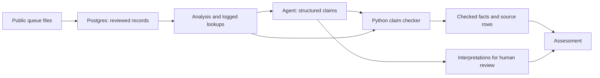

# Headway

### AI for understanding grid connections

Headway is a deployed, independent project for exploring the risk of connecting a new solar,
wind or battery project to California's grid. It combines public queue data, historical
outcome estimates and an AI agent that writes assessments with **numbers checked by code and
linked to their source rows**.

Built by [Adithya](https://github.com/adithyab-20). This repository contains the data pipeline,
statistical analysis, agent, API and interactive web app.

**[Try Headway →](https://www.headway-ai.app/)** · [Architecture decisions](docs/adr/) · [Run locally](#run-locally)

Start with a substation on the map, choose a project type and size, then open a figure to
inspect its evidence or ask the AI a question.

## What you can do

Power projects apply to a grid operator and wait for studies before they can connect.
That waiting list—the interconnection queue—contains years of evidence about which projects
were built, which withdrew and how long they waited.

Headway turns that history into a workflow:

1. **Explore the map.** Find a California substation and see the capacity realistically ahead of a new project.
2. **Compare projects.** Choose a technology and size to see historical build chances, typical waits and uncertainty ranges.
3. **Inspect the evidence.** Open the projects ahead, comparison groups, planned upgrades and source rows behind a figure.
4. **Ask the AI.** Ask questions about a substation or generate a written assessment. Numbers that fail checking are withheld.
5. **Review the result.** Change which projects count, recalculate the affected figures, and accept, reject or rewrite interpretations before finalising.

The map and numerical analysis work without an API key. AI questions and written assessments
require an Anthropic key.

## The engineering problem

An AI assessment is useful only if a reader can audit it. Headway makes that requirement part
of the data model and rendering path.

The agent returns structured claims. Each numerical value names its dataset, logged lookup,
derivation and source rows. Python checks those claims before the application renders them:
raw-data aggregates are recalculated from Postgres; statistical outputs are compared with
what the tested analysis functions returned. Unit-specific tolerances handle rounding.



A correct sum over a convenient subset of a query's rows still fails: aggregate claims must
cite the full returned set. Interpretations are separate from checked facts, and changes to
the comparison group trigger recalculation and an audit log.

**What checking does not prove:** the agent may choose the wrong substation or filter and
still quote numerically correct results. Real-model answer-key tests compare its selections
with independently written SQL. Whether past projects are a fair comparison remains a
human judgement. Headway describes historical outcomes; it does not replace a grid study.

## Design choices worth inspecting

| Problem | Implementation | Where to look |
| --- | --- | --- |
| Messy spreadsheets and inconsistent substation names | Source-specific loaders, deterministic normalisation and reviewed aliases; unmatched names stay visible. Fuzzy matching is confined to an offline review tool. | [Load pipeline](backend/src/interconnection_agent/load.py), [POI normalisation](backend/src/interconnection_agent/poi/) |
| Projects still waiting distort naive success rates | Aalen–Johansen competing-risk estimates distinguish built, withdrawn and still-waiting projects; seeded bootstrap resampling gives reproducible uncertainty ranges. | [Estimator](backend/src/interconnection_agent/chances/estimate.py), [Backtesting](backend/src/interconnection_agent/chances/backtest.py) |
| Plausible AI prose can hide unsupported numbers | Structured claims, logged lookups, source-row checks and deterministic validation gate the displayed facts. | [Checker](backend/src/interconnection_agent/assessment/check.py), [Design decision](docs/adr/0003-claims-are-generated-structured-not-parsed-from-prose.md) |
| Users need to challenge assumptions | Proposed adjustments require confirmation; changing the counted projects recalculates dependent facts. Interpretations need an explicit review decision. | [Review model](backend/src/interconnection_agent/assessment/review.py) |
| Long model calls and public usage need bounds | Background write-up generation with progress polling, per-assessment token/turn budgets, daily usage limits and a monthly spending cap. | [API](backend/src/interconnection_agent/api/), [Budget](backend/src/interconnection_agent/budget.py), [Spending](backend/src/interconnection_agent/spending.py) |
| Incomplete location data can make a map misleading | Exact positions appear as dots; places without them appear at county level. Proposed substations have a distinct marker. | [Map](frontend/components/map/MapApp.tsx), [Location decision](docs/adr/0004-where-map-points-come-from.md) |

## Stack and deployment

- **Frontend:** Next.js, React, TypeScript and Leaflet.
- **Backend:** Python 3.12+, FastAPI, PostgreSQL and the Anthropic SDK.
- **Deployment:** Vercel frontend; Dockerised API and Postgres on Railway. The frontend proxies API requests through the same origin.
- **CI:** Ruff, strict mypy, pytest, frontend type checking and build, Docker image build, and a full-history Gitleaks scan.

## Validation

The tests exercise different failure modes rather than treating a passing number check as
proof of an entire assessment:

- [Claim-checker integration tests](backend/tests/integration/test_number_check.py) feed the checker valid claims and deliberately broken variants.
- [Data cross-validation](backend/tests/integration/test_crossvalidation.py) compares outcomes across CAISO, Berkeley Lab and a published California Public Advocates report.
- [Answer-key evaluations](backend/tests/e2e/test_answer_key.py) check the real agent's numbers and selected rows against independent SQL. These require an API key and are skipped without it.
- [Browser tests](backend/tests/e2e/test_map_app.py) exercise the web app with the API, a real database and a scripted model.

See [the CI workflow](.github/workflows/ci.yml) and [test layout](backend/tests/README.md).

## Run locally

Requires Docker, [uv](https://docs.astral.sh/uv/) and Node.js 22.

```bash
# From the repository root: prepare the database and start the API.
cd backend
docker compose up -d
uv sync --frozen
uv run python -m interconnection_agent.cli load
uv run python -m interconnection_agent.api
```

In a second terminal, from the repository root:

```bash
cd frontend
npm ci
npm run dev
```

Open **http://localhost:3000**. The API uses port 8000 and local Postgres uses port 5433.

To enable AI features, copy `backend/.env.example` to `backend/.env` and set
`ANTHROPIC_API_KEY`. Set a monthly spending cap in the Anthropic console before making model
calls. The app also enforces its own usage limits.

[Full setup, configuration, checks and deployment guide →](docs/development.md)

## Scope and data

Headway is live in preview. Saving and sharing assessments are not implemented yet.
The current analysis focuses on California generation projects; newer projects under the
2023 rule change do not yet have enough history to score.

Sources include CAISO's public queue reports, Berkeley Lab's *Queued Up* dataset,
OpenStreetMap and US Census boundaries. Source data has its own terms; see
[data and credits](backend/data/README.md). This is an independent project and is not
affiliated with or endorsed by the grid operator.

[Domain glossary](CONTEXT.md) · [Architecture decisions](docs/adr/) · [Issues and feedback](https://github.com/adithyab-20/interconnection-agent/issues)
